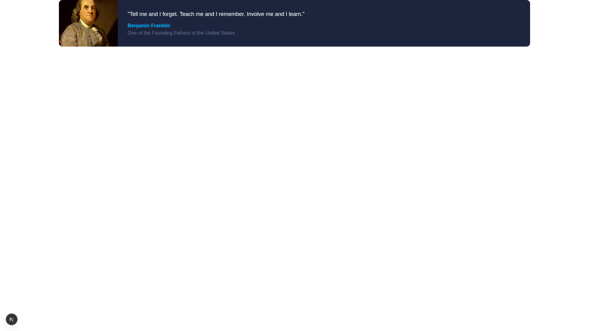
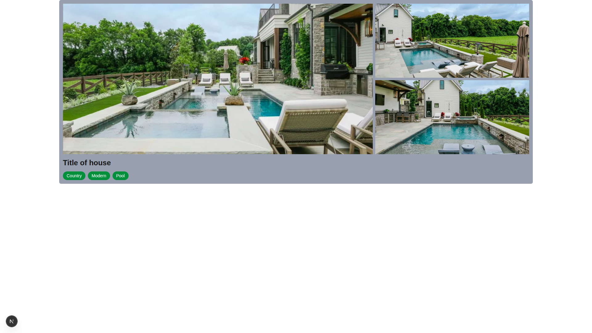
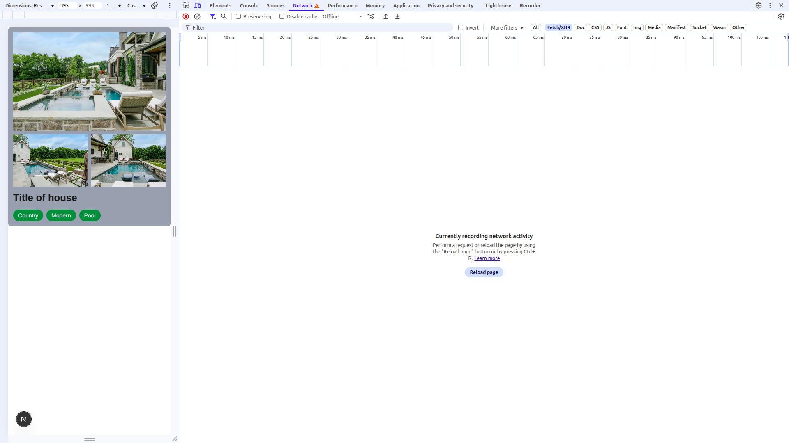
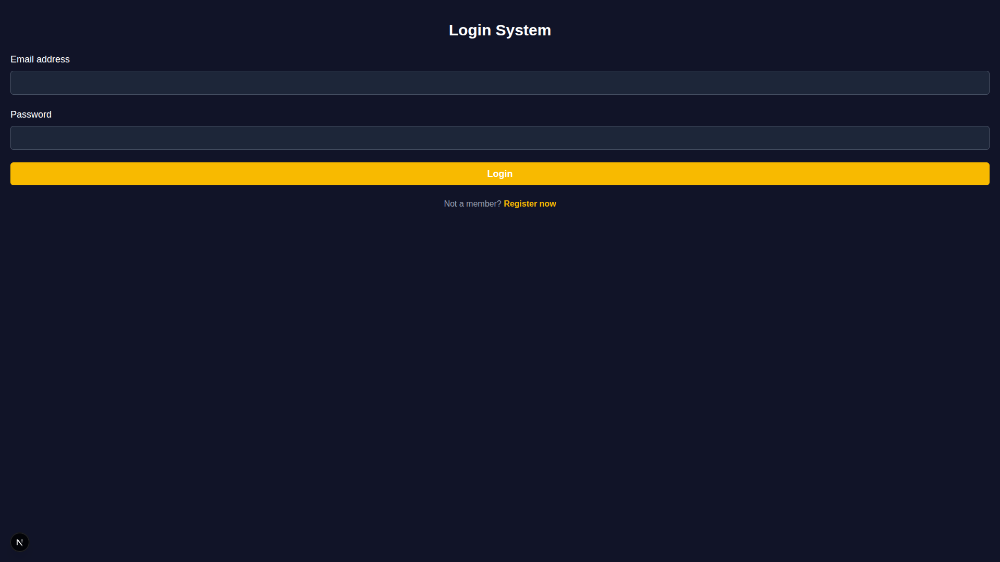
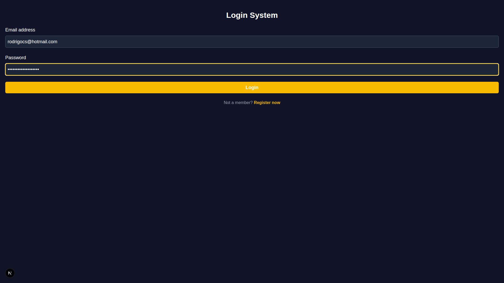
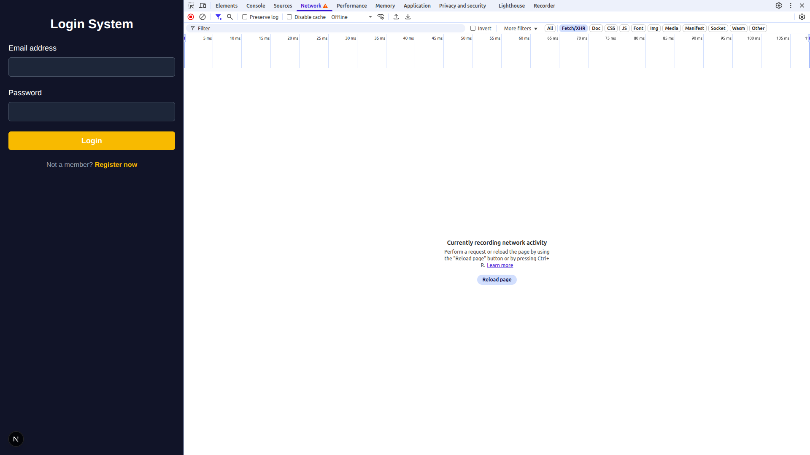
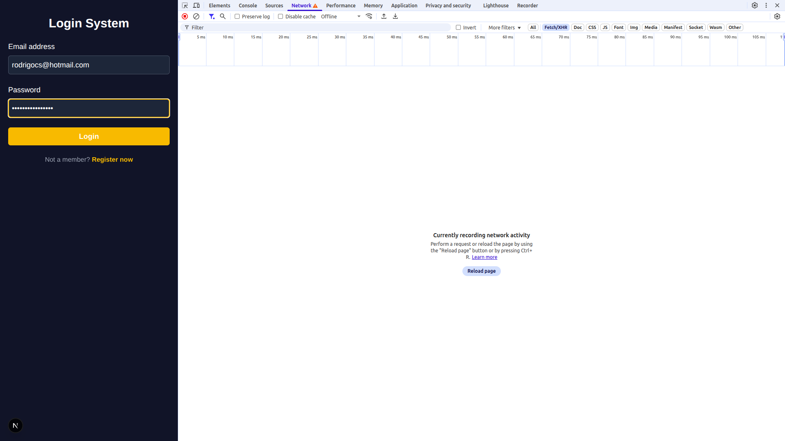
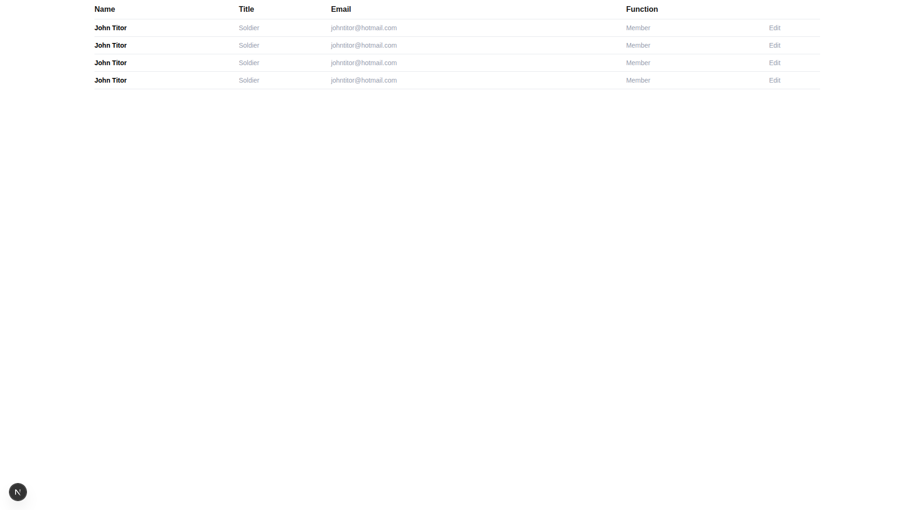

# Tailwind Exercises

A collection of exercises and mini-projects built with **Tailwind CSS**.  
The goal is to practice utility-first styling while building clean and responsive interfaces.

---

## 📂 Projects Included

### 🖼️ Hero Card
A modern hero card layout with highlighted content.  
Features:
- Centered hero section
- Clean typography
- Tailwind responsive utilities  

---

### 🏡 House Showcase
A showcase layout for modern houses.  
Features:
- Multiple house highlights
- Responsive design with Tailwind grid  

  

---

### 🔑 Login Screens
Different login screen variations styled with Tailwind CSS.  
Features:
- Multiple UI layouts
- Responsive and minimal  

  
  
  

---

### ⏳ Loading Screen
A minimal loading screen example with Tailwind styling.  

---

### 📊 Table Example
A styled table displaying structured data.  

---

## 🛠️ Technologies Used
- **Tailwind CSS** → Utility-first styling
- **HTML & React** (depending on the exercise)

---

## 📄 License
This repository is licensed under the MIT License.
